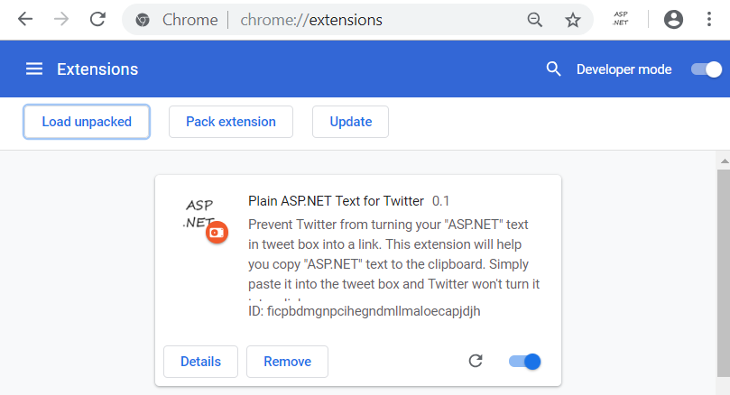
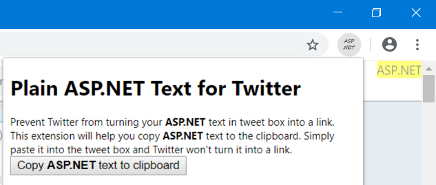
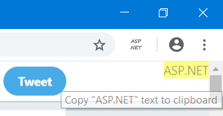
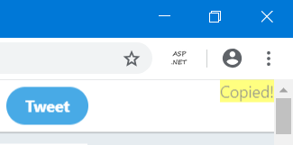
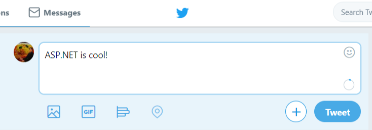
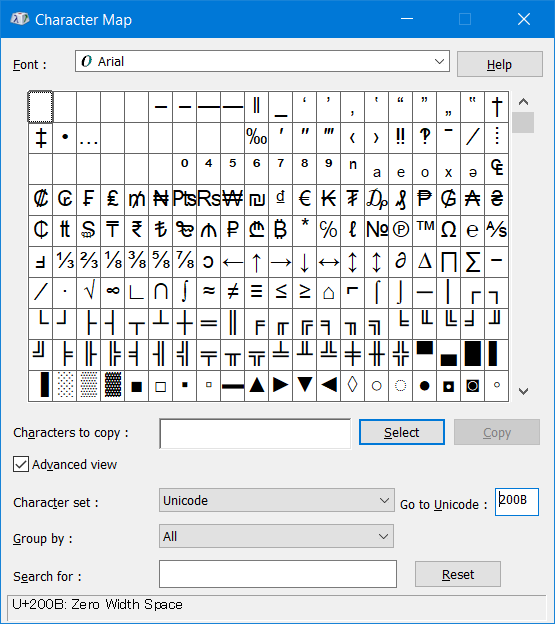

# Plain ASP.NET Text for Twitter (Chrome/Vivaldi/Firefox Extension)

>Experimental - I started this simple project to serve my own purpose.

Prevent Twitter from turning your \"ASP.NET\" text in tweet box into a link. This extension will help you copy \"ASP.NET\" text to the clipboard. Simply paste it into the tweet box and Twitter won't turn it into a link.

## Setup

- Chrome/Vivaldi  
  Follow instruction here to load the extension:  
  https://developer.chrome.com/extensions/getstarted  
  Select `src` as the extension directory.  
  

- Firefox  
  Follow instruction here to load the extension:  
  https://developer.mozilla.org/en-US/Add-ons/WebExtensions/Temporary_Installation_in_Firefox  
  Select `src` as the extension directory.

## How to use

- Popup
  - Go to https://twitter.com/.
  - Click the extension icon.
      
  - Click "Copy ASP.NET text to clipboard" and then simply paste it into the tweet box.
  - You can also click the overlay at the top-right corner of the page.  
      
      
      

## How does it work

It works by inserting zero width space character (`\u200B`) to trick the URL parser.
  

Inspired by https://twitter.com/jeremylikness/status/1001460070352392193

## License

[MIT license](LICENSE).